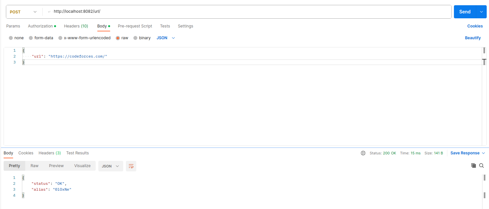

# URL Shortener 

Микросервис для сокращения ссылок, сохранение и удаление ссылок и их псевдонимов, редирект по псведонимам.(Для сохранения и удаления URL необходима авторизация)

Используемые технологии:
- SQLite (в качестве хранилища данных)
- Chi (веб фреймворк)
- go-sqlite3 (драйвер для работы с SQLite)
- golang/testify (для тестирования)

## Examples
- [Сохранение](#save)
- [Удаление](#delete)
- [Редирект](#redirect)

### Сохранение 

Сохранение с авторизацией и не зарезервированным alias:

Сохранение с авторизацией и зарезервированным alias:

Сохранение без указания alias:

Сохранение с неудачной попыткой авторизации:

### Удаление 

Удаление существующего alias:

Удаление несуществующего alias:

### Редирект 

